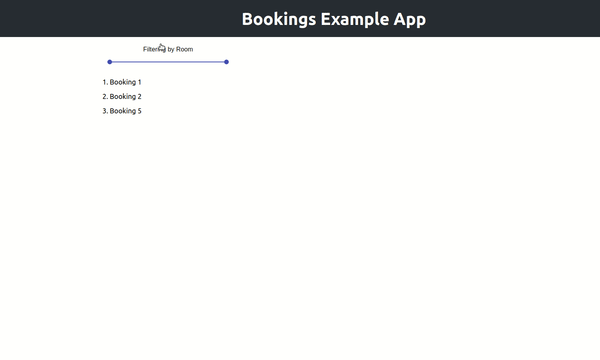

# Booking System Backend

Frontend https://github.com/cannyedge34/booking-fe

Demo video example: https://youtu.be/t5Da7pjj6Cw



# EXAMPLES
With no filter
```
booking-be$ http "http://localhost:3002/bookings"
HTTP/1.1 200 OK
Cache-Control: max-age=0, private, must-revalidate
Content-Type: application/json; charset=utf-8
ETag: W/"814cc51924ac561bc1329550a5ed26a4"
Referrer-Policy: strict-origin-when-cross-origin
Transfer-Encoding: chunked
X-Content-Type-Options: nosniff
X-Download-Options: noopen
X-Frame-Options: SAMEORIGIN
X-Permitted-Cross-Domain-Policies: none
X-Request-Id: 047cd7a0-7d62-46fb-89ff-196a0e42d545
X-Runtime: 0.034312
X-XSS-Protection: 1; mode=block

[
    {
        "created_at": "2020-11-12T19:44:32.514Z",
        "description": "Booking 1",
        "ends_at": "2020-11-12T22:44:32.488Z",
        "id": 1,
        "space_id": 1,
        "starts_at": "2020-11-12T19:44:32.488Z",
        "updated_at": "2020-11-12T19:44:32.514Z"
    },
    {
        "created_at": "2020-11-12T19:45:07.887Z",
        "description": "Booking 2",
        "ends_at": "2020-11-11T22:45:07.884Z",
        "id": 2,
        "space_id": 2,
        "starts_at": "2020-11-11T19:45:07.884Z",
        "updated_at": "2020-11-12T19:45:07.887Z"
    }
]
```

With filters
```
booking-be$ http "http://localhost:3002/bookings?rooms_number%5B%5D=2"
HTTP/1.1 200 OK
Cache-Control: max-age=0, private, must-revalidate
Content-Type: application/json; charset=utf-8
ETag: W/"c23b1ff5edb5d733fbc99f23fa048d3c"
Referrer-Policy: strict-origin-when-cross-origin
Transfer-Encoding: chunked
X-Content-Type-Options: nosniff
X-Download-Options: noopen
X-Frame-Options: SAMEORIGIN
X-Permitted-Cross-Domain-Policies: none
X-Request-Id: 837f1050-833c-482d-a9e9-8c598c4c36cd
X-Runtime: 0.018246
X-XSS-Protection: 1; mode=block

[
    {
        "created_at": "2020-11-12T19:45:07.887Z",
        "description": "Booking 2",
        "ends_at": "2020-11-11T22:45:07.884Z",
        "id": 2,
        "space_id": 2,
        "starts_at": "2020-11-11T19:45:07.884Z",
        "updated_at": "2020-11-12T19:45:07.887Z"
    }
]
```